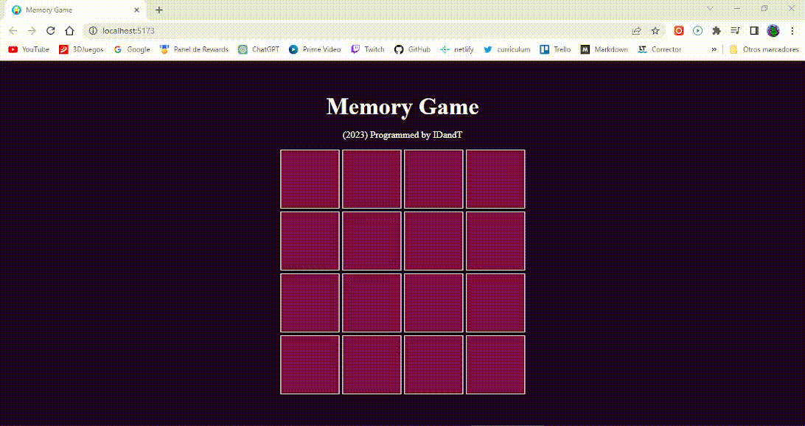

# Memory Game

## Description

A simply memory card game where you need to match pairs by turn over 2 cards at a time.

Programmed with React for learning pourposes only.

## Tools

- Developed with Vite + React
- Visual Studio Code

## How to run project

Follow the next steps:

Clone repository:

    git clone https://github.com/IDandT/memory-game

Install dependencies:

    cd memory-game
    npm install

Run game:

    npm run dev
